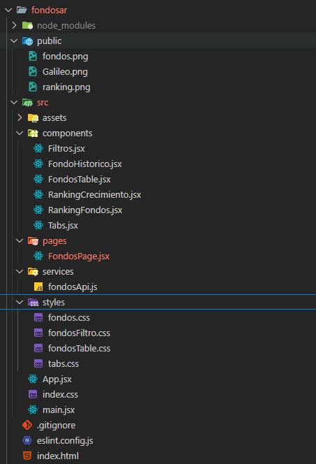
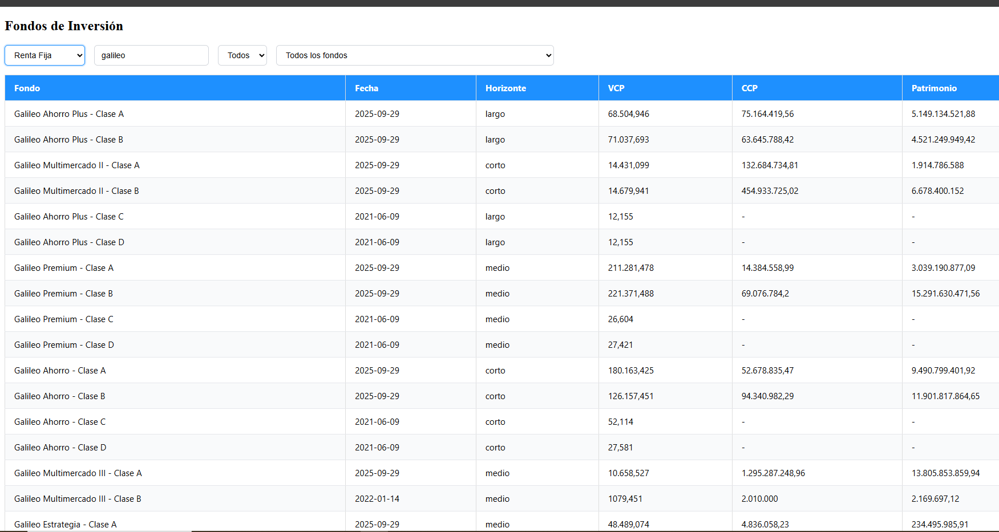
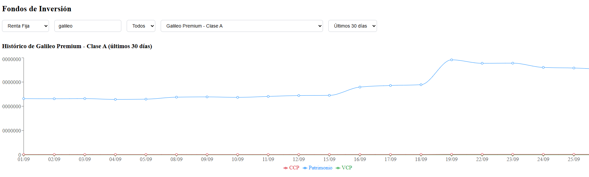
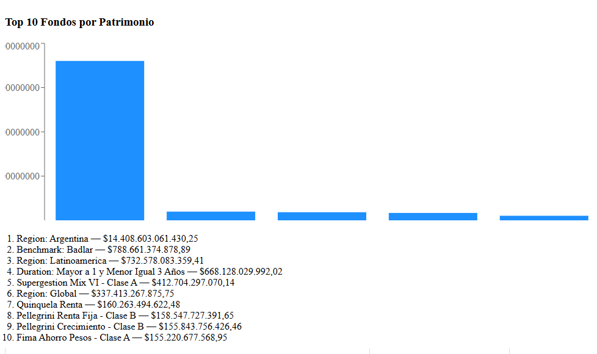

# 📊 Fondos de Inversión - Dashboard React

Aplicación web en **React** que consume la API pública de [ArgentinaDatos](https://api.argentinadatos.com/) para mostrar información sobre **Fondos Comunes de Inversión**.

Permite:

- Listar y filtrar fondos (por nombre y horizonte).
- Visualizar un **ranking top 10** por patrimonio.
- Seleccionar un fondo y ver su **histórico patrimonial** con gráficos interactivos.
- Comparar la evolución de un fondo en períodos de **30 / 60 / 90 días**.
- Cambiar entre tipos de renta: **Renta Fija, Renta Mixta y Renta Variable**.

---

## 🚀 Tecnologías usadas

- [React](https://react.dev/) (Hooks + componentes funcionales)
- [Recharts](https://recharts.org/en-US/) para gráficos dinámicos
- [Vite](https://vitejs.dev/) como bundler (rápido y moderno)
- CSS personalizado para estilo limpio y moderno
- [ArgentinaDatos API](https://api.argentinadatos.com/) como fuente de datos financieros

---

## Estructura



## Todos los fondos



## filtro y grafico de un fondo



## ranking



## 📦 Instalación y uso

Cloná este repositorio:

```bash
git clone https://github.com/gustaboin/fondosAr.git
cd fondosAr

npm install
npm run dev
```
